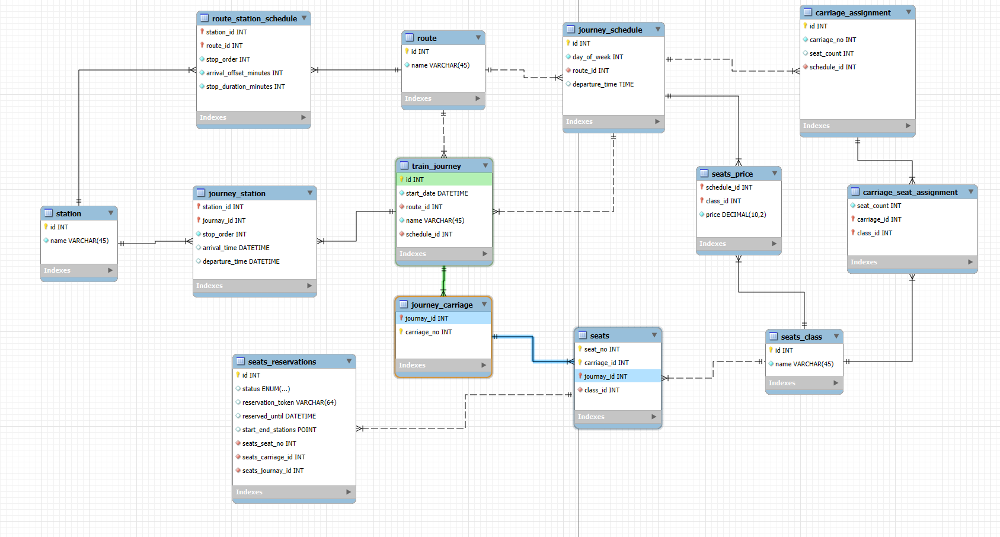

## Online Railway Ticket Reservation System
The service allows reserving tickets for specific train routes using the int4range type in PostgreSQL. This makes it possible to create reservations for specific parts of a train journey between chosen stations.

There are also automated tasks: one for generating train journeys based on predefined routes and schedules, and another for cleaning up expired reservations. The database uses PostgreSQL with the unaccent extension for better text searching and btree_gist for optimized range queries.

This setup ensures the system works efficiently, keeps the data clean, and makes querying fast.

## Project setup

```bash
$ npm install
```

## Compile and run the project

```bash
# development
$ npm run start

# watch mode
$ npm run start:dev

# production mode
$ npm run start:prod
```

## Run tests

```bash
# unit tests
$ npm run test

# e2e tests
$ npm run test:e2e

# test coverage
$ npm run test:cov
```

## License

Nest is [MIT licensed](https://github.com/nestjs/nest/blob/master/LICENSE).
